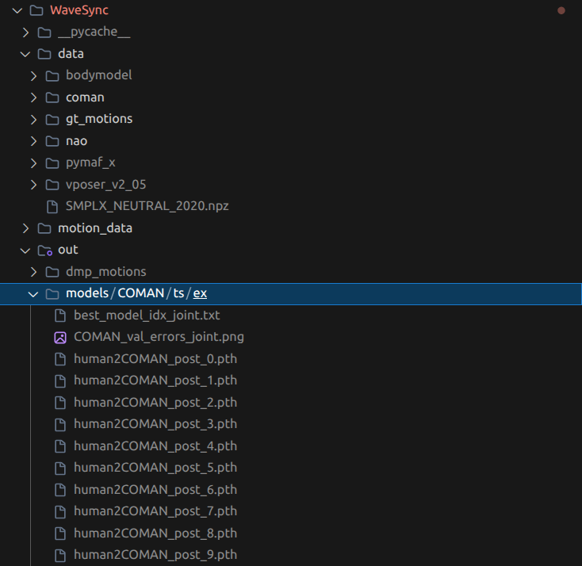

# WaveSync

## Installation
Install the Python dependencies:
```bash
pip install -r requirements.txt
```

## Dataset & Model Setup

Before running the simulation, you need to set up the required data and model weights.

1. Download the `data` and `out/models` folders from [Google Drive](https://drive.google.com/drive/folders/1H9Bt5Vaat80koK4s8-PDnQ5K79fKh3ND?usp=sharing).
2. Place these folders in the root directory according to the structure shown below:



## Usage

The core simulation is executed via `execute.py`. You can trigger predefined scenes from the `scene/` directory.

```bash
# Run scenes
python execute.py -s scene1.json
python execute.py -s scene2.json
python execute.py -s scene3.json
python execute.py -s scene4.json
python execute.py -s scene5.json
```
